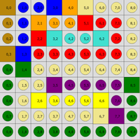
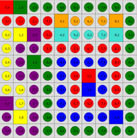
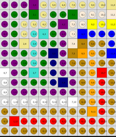

# Flow Free Solver
A solver for Flow Free puzzles using _back tracking_ search for CSPs.

## The problem
Boards are typically a square grid with any number of colors to connect. A _well-designed_ board (an assumption made by this solver) has a unique solution, and requires the entire board to be filled in without any "zig-zagging" paths. A consequence of being an NP-complete puzzle is that, although solutions can be verified quickly, there is no known efficient algorithm to find a solution, and the time required to solve the problem increases very quickly as the board size grows. How do we leverage a computer to quickly find the solution to a given board? We can devise a metric to score potential paths towards the solution, and we investigate the paths that maximize this function first.

## Getting started
### From terminal
```bash
cd ./src
python main_dumb.py # for the dumb heuristic
python main_smart.py # for the smart heuristic
```

### Graphical

```bash
# It is recommended to create a separate environment before you install the requirements
pip install -r requirements.txt
cd ./src
python app.py
```

## Approaches 
These are approaches we took to solve these puzzles, few notes need to be taken before reading. We consider the map as matrix where each element in this matrix is a _variable_ and these variables are coordinates in xy plan, where y grows downwards starting from the top left corner. Assignments are stored in a dictionary-styled data structure where keys are coordinates and values are colors for each coordinate, we use uppercase letters for terminals and lowercase for pipes.

## problem formulation
### variables 
for the map input there are (`MxN`) variables each one indicate 
* the color for it's box for the **dump** and **smart** solution 
* the direction of movement in **smarter** solution 

### domains
#### color based approach (dump/smart)
each variable is of type character and can take value as representing the color of it
the value can be `_` , `lower case character` or `upper case character` and values itself depend on map
for example in 5x5 
```
B__RO
___Y_
__Y__
_RO_G
_BG__
```
* available value are `['_','b','r','o','y','g']` for each free variable
* each terminal has domain of value equal to its color,

example (0,0) has domain ['B']
here is an example for first five variables in `5X5`

| variable  | domain                 |
| -------|---------------------- |
| (0 0)  | ['B']                 |
| (0 1)  | ['_','b','r','o','y','g'] |
| (0 2)  | ['_','b','r','o','y','g'] |
| (0 3)  | ['_','b','r','o','y','g'] |
| (0 4)  | ['R']                 |
| (0 5)  | ['O']                 |

> worth noting here we didn't use numerical representation so we can make the formulas easier to write and debug as formulas became smaller and their number reduced 

> our approach may be converted to numerical by creating `MxN` variable for each color with domain [0,1]

### Constraints
These are the procedures we took to check the consistency of any new assignments.

`Is_good_combination`

What we mean by good combination here the state of the selected assignment don't/won't cause any problems. we can wrap them up in the following points

- Number of free neighbors >= 2 => true
- Number of similar neighbors == 1 and Number of similar neighbors == 1 => true
- Number of similar neighbors == 2 and not(is surrounding square filled) => true
- Otherwise => false

those constains are implemented easly for example for varialbe `(0 1)` in 5x5 map the first constrain would be
with neighbors `x_1_1` and `x_0_2`
```
Implies(x_0_1 == 'b', OR(
    x_1_1 == '_') + (x_0_2 == '_') == 2,
    And(x_1_1 == '_')==1 ,(x_0_2 == 'b')==1),
    (x_1_1 == 'b') + (x_0_2 == 'b') == 2))
    )
```

and same implies for other colors and neighbor variables 

despite being complex but we can easily check this constrain using a for loop and if condition 
here is python code for it
```python 
    comb_points_of_interest = [current_assignment_coord]
    comb_points_of_interest.extend(
        get_neighbors_coords(current_assignment_coord,len(inp),len(inp[0])))
    for coord in comb_points_of_interest:
        if is_empty(assignments, coord) or assignments[coord].isupper():
            continue
        good_comb = check_for_good_combinations(
            coord, assignments[coord], assignments, inp)
        if not good_comb:
            return False

    return True
```

`Is_neighbors_terminals_have_valid_path`

Checks weather or not any neighboring terminal in _locked out_, in other word if our newly assigned `var : value` causes any problem.

`Is_terminal_connected`

Use the cached on demand updated terminals to check if the same `value` terminals are already connected, because if so, it doesn't make sense to assign that value to a variable again

### Dumb algorithm
For dumb algorithm we used 2 alternative approuches for picking the random variable, totally random variable and the next free variable.

#### Totally random
Picking a random value and random variable each time check whether or not this assignment is consultant. If it was consistent move to the next assignment in a _DFS-styled_ backtracking.

#### Results for dump

| map​ | time​ | Number of hits​                                        |
| ---- | ----- | ------------------------------------------------------ |
| 5x5​ | 7 ms​ | 443  |
| 7x7​ | +24hrs​ | ???  |
| ... | ? ms | ???  |

### Next free variable
as seen in previous result the total random gave very bad times we tried the next dumpiest thing witch just take same order as the map and surpassingly we got some great results

the order is 
For you free variables pick the first one as my next variable starting from (0,0)

| map​ | time​ | Number of hits​                                        |
| ---- | ----- | ------------------------------------------------------ |
| 5x5​ | 2 ms​ | 124  |
| 7x7​ | 7 ms​ | 452  |
| 8x8​ | 200 ms​ | 15695  |
| 9x9​ | 80 ms​ | 6208  |
| 10x10 1​ | 200 ms​ | 13396  |
| 10x10 2​ | 3 s​ | 255112  |
| 12x12​ | 158 s​ | 12903209  |
| 12x14 | ? ms | ???  |

#### Results
##### Totally random

**5x5:**
```
map ../input/input55.txt solution time = 0.005998373031616211 sec
map ../input/input55.txt number of hits = [443] 
BrrRO
bryYo
brYoo
bROoG
bBGgg
```

**7x7 and higher:**

TimeOut! more than (24hrs)

##### First free variable

**5x5:**
```
map ../input/input55.txt solution time = 0.002267599105834961 sec
map ../input/input55.txt number of hits = [124] 
BrrRO
bryYo
brYoo
bROoG
bBGgg
```

**7x7:**
```
map ../input/input77.txt solution time = 0.007232666015625 sec
map ../input/input77.txt number of hits = [452] 
gggOooo
gBggGYo
gbbBRyo
gyyYryo
gyrrryo
gyRyyyo
GyyyOoo
```

**8x8**
```
map ../input/input88.txt solution time = 0.20182538032531738 sec
map ../input/input88.txt number of hits = [15695] 
yyyRrrGg
yBYPprrg
yboOpGRg
yboPpggg
ybooooYy
ybbbBOQy
yQqqqqqy
yyyyyyyy
```

**9x9**
```
map ../input/input991.txt solution time = 0.0804746150970459 sec
map ../input/input991.txt number of hits = [6208] 
DbbBOKkkk
dbOooRrrk
dbRQqqQrk
DBrrrrrrk
gGkkkkkkk
gkkPppppG
gkYyyyYpg
gkkkkkKPg
ggggggggg
```

**10x10 1**
```
map ../input/input10101.txt solution time = 0.22327589988708496 sec
map ../input/input10101.txt number of hits = [13396] 
RGgggggggg
rrrrOoooOg
yYPrQqqqQg
ypprrrrrrg
ypGgbbbbrg
yppgbrRbrg
yypgbrBbrg
Pypgbrrrrg
pYpgbbbbBg
pppggggggg
```

**10x10 2**
```
map ../input/input10102.txt solution time = 3.133574962615967 sec
map ../input/input10102.txt number of hits = [255112] 
tttppppppp
tBtpfffffp
tbTPFBTVfp
tbbbbbtvfp
tttttttvfP
Fnnnnnnvff
fnssssnvvf
fnSNHSNHvf
fnnnhhhhVf
ffffffffff
```

**12x12**
```
map ../input/input1212.txt solution time = 148.92762875556946 sec
map ../input/input1212.txt number of hits = [12903209] 
kkkkkkkkkkkk
kooooooooook
kokkkKyYgGok
kokYyyyGgook
kOkPpoooooQk
kkkRpOQqqqqk
rrrrPaARKkkk
rDddDaWrrrrr
raaaaawwwwWr
raBbbbbbbbBr
raaaaaaaaaAr
rrrrrrrrrrrr
```


### Smart Algorithm
Using a combination of helping heuristics and approaches that can be controlled via `config` dict in `src/algorithms/smart.py` including **MRV** to chose the next variable, **LCV** for choosing the value, **Degree Heuristics** as a tie breaker and **Weak locker** these heuristic are _"togglable"_ due to optimization issues, check optimization labeled PRs for more information.

used combination:
* Forward checking ​
* MRV (minimum remaining value)​
* Degree heuristic​
* Least constraining value​

# forward checking
* find domain for variables
* if variable has zero domain 
* return case failure
```python
def forward_check(variables_domain):
    for coords in variables_domain:
        if len(variables_domain[coords]) == 0:
            return False
    return True
```
#### Results
\
**5x5**
## results
* without forward_check

  | map​ | time​ | Number of hits​                                        |
  | ---- | ----- | ------------------------------------------------------ |
  | 5x5​ | 7 ms​ | 443  |


* with forward_check
 
  | map​ | time​ | Number of hits​                                         |
  | ---- | ----- | ------------------------------------------------------- |
  | 5x5​ | 9 ms​ | 28​ 


## MRV

* find domain for variables
* choose variables with smallest domain

* implementation pseudo code
```python
    smallest_domain = math.inf
    selected_coords = []
    for coord in variables_domain:
        domain_len = len(variables_domain[coord])
        if domain_len < smallest_domain:
            selected_coords = []
            smallest_domain = domain_len

        if smallest_domain == domain_len:
            selected_coords.append(coord)

    return selected_coords
```

#### initial results * 
<!-- https://github.com/A-Siam/FlowFree/pull/2 -->
| map   | time (s) |
| ----- | -------- |
| 7x7   | 1.87     |
| 8x8   | 1.73     |
| 9x9   | 6.87     |
| 10x10 | ?.??     |

# optimization
### limitation
* variable domain calculation increase with map size

  * example 
    * 14x14 every time calculate domain <br/>
      for (196 - terminals) variable
  * solution

    * update only constrained variables

* consistency check represent the bottleneck

## improvement in constrains
profile for 991


<span> terminal constrain was checking <span class="fragment highlight-red"> every </span>terminal has only on path </span>

### update
<span> check only <span class="fragment highlight-blue"> neighbor </span> terminals </span>
this improved performance significantly

profile for 991


#### results
| map      | time (s) |
| -------- | -------- |
| 7x7      | 0.085    |
| 8x8      | 0.157    |
| 9x9      | 0.858    |
| 10x10(1) | 3.300    |
| 10x10(2) | 1.680    |
| 12x12    | 14.971   |
| 12x14    | ??.???   |

## lazy surrounding squares
<span> check surrounding squares "zigzag" only when have<span style="color: #1B91FF "> 2 same color neighbors. </span>Because if we have a good combination we are in one of these two cases</span>

*  only <span style="color: #1B91FF ">one free neighbor and same color neighbor</span> (no squares)
*  only <span style="color: #1B91FF ">2 or more free neighbors</span> (no squares)


#### implementation
```python
def check_for_good_combinations(coord, current_color, assignments, inp):
    empty_neighbors = search_around(coord, inp, assignments, is_empty)
    if len(empty_neighbors) >= 2:
        return True
    same_color_neighbors = get_same_color_neighbors(
        coord, current_color, assignments, inp)
    if len(same_color_neighbors) == 2:
        # we don't need is surrounding square anywhere but here
        ssf = is_surrounding_square_filled(assignments,inp,coord)
        return not ssf
    if len(empty_neighbors) == 1 and len(same_color_neighbors) == 1:
        return True
    return False
```

#### Results
| map      | time (s) |
| -------- | -------- |
| 10x10(1) | 2.26    |
| 10x10(2) | 1.09    |
| 12x12    | 8.72   |
| 12x14    | ??.???   |

--------

## Cache connected terminals
We can cache connected terminals to quickly check whether or not the selected value is consistent\
Using a shared object between backtracks that gets updated only when a variable is consistent 

#### Implementation
Inside backtrack 

```python
if is_consistant(initial_state, {var: value},  assignments, inp, connected_terminals):
    before_assgen_connected_terminal = connected_terminals
    refreshed_connected_terminals = refresh_connected_terminals( {var: value}, assignments, connected_terminals, initial_state, inp)
```
#### Results
| map      | time (s) |
| -------- | -------- |
| 10x10(1) | 1.49    |
| 10x10(2) | 0.728    |
| 12x12    | 5.38   |
| 12x14    | ??.???   |

-------

### dynamic domain-upgrade

* save variable domain
* only update <span class="fragment highlight-blue">constrained variables</span>

#### the constrained variables
  
  *  are empty neighbor  (point good combination) 
  * are empty neighbor for occupied neighbor   
      (point neighbors/terminal combination)
  * <span class="fragment" > every point when terminal is connected 
      <span class="fragment highlight-blue"> (terminal connected) </span> </span>

implementation
```python 
variables_domain = {}
connection_changed = len(connected_terminals)>len(prev_connected_terminal)
first_run = prev_variable == None
if connection_changed or first_run:
    # update all variables
    for coord in variables:
        domain = get_available_domain(coord,
        assignments,connected_terminals)
        variables_domain[coord] = domain
else:
    variables_domain = pickle.loads(pickle.dumps(prev_domain))
    del variables_domain[prev_variable]
    big_neighbors = get_constrained_neighbors(prev_variable,inp,assignments )
    for coord in big_neighbors:
        domain = get_available_domain(coord, assignments, inp,connected_terminals)
        variables_domain[coord] = domain
return variables_domain
```

#### results
| map​       | time​    | Number of hits​ |
| ---------- | -------- | --------------- |
| 5x5​       | 6 ms​    | 17​             |
| 7x7​       | 16 ms​   | 41​             |
| 8x8​       | 30 ms​   | 52​             |
| 9x9 (1)​   | 57 ms​   | 67​             |
| 10x10 (1)​ | 189 ms​  | 320​            |
| 10x10(2)​  | 93 ms​   | 139​            |
| 12x12​     | 290 ms​  | 331​            |
| 12x14​     | 193 ms​  | 148​            |
| 14x14​     | 7875 ms​ | 10309​          |


# degree heuristic
- use as tie breaker
- choose variable that constrain others
implementation
```python
most_constraining_count = -math.inf
for coord in variables:
    constrained_count = len(
        get_constrained_neighbors(coord,inp, assignments))
    if constrained_count > most_constraining_count:
        most_constraining_count = constrained_count
        most_constraining_var = coord
return most_constraining_var
```
### results
- didn't improve
- made heuristic optional

# least constraining value
- choose value that doesn't affect domains


implementation
<!-- TODO simplify this -->
```python 
count_value_ordered = []
for value in domain:
    updated_variable_domains = get_available_domain_multiple(
        {**{coord: value}, **assignments}, inp, coord,)
    count_constrained = 0
    
    for coord in updated_variable_domains:
        if len(updated_variable_domains[coord]) < len(variables_domain[coord]):
            count_constrained += 1

    count_value_ordered.append((count_constrained, value))
count_value_ordered.sort()
order_domain_values = []
for count, value in count_value_ordered:
    order_domain_values += value

return order_domain_values
```

#### results
| map​       | time​                              | Number of hits​ |
| ---------- | ---------------------------------- | --------------- |
| 5x5​       | 5 ms​                              | 17​             |
| 7x7​       | 16 ms                              | 56​             |
| 8x8​       | 23 ms​                             | 52​             |
| 9x9 (1)​   | 65 ms​                             | 100             |
| 10x10 (1)​ | 166 ms​                            | 330​            |
| 10x10(2)​  | <span style="color:red"> 240 ms​   | 482             |
| 12x12​     | <span style="color:red"> 838 ms​   | 1178            |
| 12x14​     | <span style="color:aqua"> 163 ms​  | 146​            |
| 14x14​     | <span style="color:aqua"> 2230 ms​ | 2374​           |


# <span class="fragment highlight-blue"> Smarter solver <span>
using directions

* We used direction values instead of color values.
* Directions offers better arc consistency
<!-- .element: class="fragment" -->
* Values domain is <!-- .element: class="fragment" --><br/>`{'└', '┌', '│', '┘', '─', '┐'}`
<!-- .element: class="fragment" -->
* We can use initially_forced constrains
<!-- .element: class="fragment" -->

* Four corners have initial single domain value propagating until hitting a number.
* Border variables has three values domain.


* Directions have powerful arc consistency that can be used initially to eliminate domain values.


* After forced elimination of domain values we can start assignment.
* We should start by one-domain-value variables
<!-- .element: class="fragment" -->
* After every assignment, the neighbor variables domains is affected 
<!-- .element: class="fragment" -->


* We should add variables for colors to check that the correct colors are connected together.
* The directions method solver have almost 3 values domain after initial eliminations
<!-- .element: class="fragment" -->

* This is very good branch factor compared to other methods.

# final results for smart
| map​       | time​                              | Number of hits​ |
| ---------- | ---------------------------------- | --------------- |
| 5x5​       | 5 ms​                              | 17​             |
| 7x7​       | 16 ms                              | 56​             |
| 8x8​       | 23 ms​                             | 52​             |
| 9x9 (1)​   | 65 ms​                             | 100             |
| 10x10 (1)​ | 166 ms​                            | 330​            |
| 10x10(2)​  |  240 ms​   | 482             |
| 12x12​     |  838 ms​   | 1178            |
| 12x14​     |  163 ms​  | 146​            |
| 14x14​     |  2230 ms​ | 2374​           |


## **5x5:**

For graphical results see figure 1.
```
map ../input/input55.txt solution time = 0.005002737045288086 sec
map ../input/input55.txt number of hits = [17] 
BrrRO
bryYo
brYoo
bROoG
bBGgg
```


## **7x7**

for graphical results see figure 2.

```
map ../input/input77.txt solution time = 0.01697063446044922 sec
map ../input/input77.txt number of hits = [56] 
gggOooo
gBggGYo
gbbBRyo
gyyYryo
gyrrryo
gyRyyyo
GyyyOoo
```


## **8x8**

for graphical results see figure 3.

```
map ../input/input88.txt solution time = 0.023000001907348633 sec
map ../input/input88.txt number of hits = [52] 
yyyRrrGg
yBYPprrg
yboOpGRg
yboPpggg
ybooooYy
ybbbBOQy
yQqqqqqy
yyyyyyyy
```


## **9x9**

for graphical results see figure 4.

```
map ../input/input991.txt solution time = 0.06594991683959961 sec
map ../input/input991.txt number of hits = [100] 
DbbBOKkkk
dbOooRrrk
dbRQqqQrk
DBrrrrrrk
gGkkkkkkk
gkkPppppG
gkYyyyYpg
gkkkkkKPg
ggggggggg
```


## **10x10 1**

for graphical results see figure 5.


```
map ../input/input10101.txt solution time = 0.16699814796447754 sec
map ../input/input10101.txt number of hits = [330] 
RGgggggggg
rrrrOoooOg
yYPrQqqqQg
ypprrrrrrg
ypGgbbbbrg
yppgbrRbrg
yypgbrBbrg
Pypgbrrrrg
pYpgbbbbBg
pppggggggg
```


## **10x10 2**

for graphical results see figure 6.


```
map ../input/input10102.txt solution time = 0.24605417251586914 sec
map ../input/input10102.txt number of hits = [482] 
tttppppppp
tBtpfffffp
tbTPFBTVfp
tbbbbbtvfp
tttttttvfP
Fnnnnnnvff
fnssssnvvf
fnSNHSNHvf
fnnnhhhhVf
ffffffffff
```


## **12x12**

for graphical results see figure 7.


```
map ../input/input1212.txt solution time = 0.8389444351196289 sec
map ../input/input1212.txt number of hits = [1178] 
kkkkkkkkkkkk
kooooooooook
kokkkKyYgGok
kokYyyyGgook
kOkPpoooooQk
kkkRpOQqqqqk
rrrrPaARKkkk
rDddDaWrrrrr
raaaaawwwwWr
raBbbbbbbbBr
raaaaaaaaaAr
rrrrrrrrrrrr
```

## **12x14**

for graphical results see figure 8.


```
map ../input/input1214.txt solution time = 0.16399812698364258 sec
map ../input/input1214.txt number of hits = [146] 
pppPkkkkkkkK
pggGkggGaaaA
pgkkkgPaaYyY
pgkqQgpaBbbb
pgKqggpADddb
pggqgNpDOodB
ppgqgnpddodd
WpgQgnppdoRd
wpgggnNpdord
wpppppppdord
wwwwwwwWdord
dddddddddOrd
dRrrrrrrrrrd
dddddddddddd
```


**14x14**

for graphical results see figure 9.


```
map ../input/input1414.txt solution time = 2.230055093765259 sec
map ../input/input1414.txt number of hits = [2374] 
oooowwwwwkkkkk
oBbowAaawkpppk
oobowwWawkpRPk
DobooAaaWkprkk
dobboooOBkprkG
dOYbbbbbbKprkg
ddyyyyyyyDprkg
Gdddddddydprkg
grrrrrRdYdprkg
grqqqqQdddprkg
grqpppppppprkg
grQPrrrrrrrrkg
grrrrKkkkkkkkg
gggggggggggggg
```


## References
Russell, S. J. (2016). Artificial intelligence: A modern approach. Harlow: Pearson.
