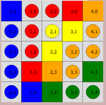

# Flow Free Solver
A solver for Flow Free puzzles using _back tracking_ search for CSPs.

## The problem
Boards are typically a square grid with any number of colors to connect. A _well-designed_ board (an assumption made by this solver) has a unique solution, and requires the entire board to be filled in without any "zig-zagging" paths. A consequence of being an NP-complete puzzle is that, although solutions can be verified quickly, there is no known efficient algorithm to find a solution, and the time required to solve the problem increases very quickly as the board size grows. How do we leverage a computer to quickly find the solution to a given board? We can devise a metric to score potential paths towards the solution, and we investigate the paths that maximize this function first.

## Approaches 
These are approaches we took to solve these puzzles, few notes need to be taken before reading. We consider the map as matrix where each element in this matrix is a _variable_ and these variables are coordinates in xy plan, where y grows downwards starting from the top left corner. Assignments are stored in a dictionary-styled data structure where keys are coordinates and values are colors for each coordinate, we use uppercase letters for terminals and lowercase for pipes.

### Constraints
These are the procedures we took to check the consistency of any new assignments.

`Is_good_combination`

What we mean by good combination here the state of the selected assignment don't/won't cause any problems. we can wrap them up in the following table

|Number of free neighbors | Number of similar neighbors | is good combination | 
|:-----------------------:|:---------------------------:| :-----------------: |
|2 or higher              | Not needed                  | True                |
|1                        | 1                           | True                |
| Otherwise               |                             | False               |
\
\
`Is_neighbors_terminals_have_valid_path`

Checks weather or not any neighboring terminal in _locked out_, in other word if our newly assigned `var : value` causes any problem.

`Is_terminal_connected`

Use the cached on demand updated terminals to check if the same `value` terminals are already connected, because if so, it doesn't make sense to assign that value to a variable again

### Dumb algorithm
Picking a random value and random variable each time check whether or not this assignment is consultant. If it was consistent move to the next assignment in a _DFS-styled_ backtracking.

**Solution:**

**5x5:**

This algorithm worked flawlessly with 5x5 input



```
map ../input/input55.txt solution time = 0.0074388980865478516 sec
BrrRO
bryYo
brYoo
bROoG
bBGgg
```

**7x7 and higher:**

TimeOut!

### Smart Algorithm

## Results

### Dumb algorithm

### Smart Algorithm

## Getting started

