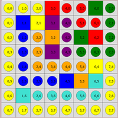
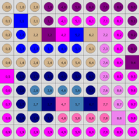
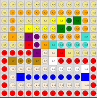
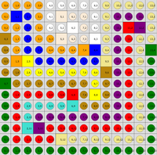

# Flow Free Solver
A solver for Flow Free puzzles using _back tracking_ search for CSPs.

## The problem
Boards are typically a square grid with any number of colors to connect. A _well-designed_ board (an assumption made by this solver) has a unique solution, and requires the entire board to be filled in without any "zig-zagging" paths. A consequence of being an NP-complete puzzle is that, although solutions can be verified quickly, there is no known efficient algorithm to find a solution, and the time required to solve the problem increases very quickly as the board size grows. How do we leverage a computer to quickly find the solution to a given board? We can devise a metric to score potential paths towards the solution, and we investigate the paths that maximize this function first.

## Getting started
### From terminal
```bash
cd ./src
python main_dumb.py # for the dumb heuristic
python main_smart.py # for the smart heuristic
```

### Graphical

```bash
# It is recommended to create a separate environment before you install the requirements
pip install -r requirements.txt
cd ./src
python app.py
```

## Approaches 
These are approaches we took to solve these puzzles, few notes need to be taken before reading. We consider the map as matrix where each element in this matrix is a _variable_ and these variables are coordinates in xy plan, where y grows downwards starting from the top left corner. Assignments are stored in a dictionary-styled data structure where keys are coordinates and values are colors for each coordinate, we use uppercase letters for terminals and lowercase for pipes.

### Constraints
These are the procedures we took to check the consistency of any new assignments.

`Is_good_combination`

What we mean by good combination here the state of the selected assignment don't/won't cause any problems. we can wrap them up in the following points

- Number of free neighbors >= 2 => true
- Number of similar neighbors == 1 and Number of similar neighbors == 1 => true
- Number of similar neighbors == 2 and not(is surrounding square filled) => true
- Otherwise => false

`Is_neighbors_terminals_have_valid_path`

Checks weather or not any neighboring terminal in _locked out_, in other word if our newly assigned `var : value` causes any problem.

`Is_terminal_connected`

Use the cached on demand updated terminals to check if the same `value` terminals are already connected, because if so, it doesn't make sense to assign that value to a variable again

### Dumb algorithm
Picking a random value and random variable each time check whether or not this assignment is consultant. If it was consistent move to the next assignment in a _DFS-styled_ backtracking.

#### Results
\
\
**5x5:**

For graphical results see figure 1.


\
```
map ../input/input55.txt solution time = 0.0074388980865478516 sec
BrrRO
bryYo
brYoo
bROoG
bBGgg
```

**7x7 and higher:**

TimeOut!

### Smart Algorithm
Using a combination of helping heuristics and approaches that can be controlled via `config` dict in `src/algorithms/smart.py` including **MRV** to chose the next variable, **LCV** for choosing the value, **Degree Heuristics** as a tie breaker and **Weak locker** these heuristic are _"togglable"_ due to optimization issues, check optimization labeled PRs for more information.

#### Results
\
\
**5x5**

For graphical See the results in figure 1.

```
map ../input/input55.txt solution time = 0.0058176517486572266 sec
BrrRO
bryYo
brYoo
bROoG
bBGgg
```

**7x7**

for graphical results see figure 2.


```
map ../input/input77.txt solution time = 0.026373863220214844 sec
gggOooo
gBggGYo
gbbBRyo
gyyYryo
gyrrryo
gyRyyyo
GyyyOoo
```

**8x8**

for graphical results see figure 3.



```
map ../input/input88.txt solution time = 0.0460352897644043 sec
yyyRrrGg
yBYPprrg
yboOpGRg
yboPpggg
ybooooYy
ybbbBOQy
yQqqqqqy
yyyyyyyy
```

**9x9**

for graphical results see figure 4.


```
map ../input/input991.txt solution time = 0.07780814170837402 sec
DbbBOKkkk
dbOooRrrk
dbRQqqQrk
DBrrrrrrk
gGkkkkkkk
gkkPppppG
gkYyyyYpg
gkkkkkKPg
ggggggggg
```

**10x10 1**

for graphical results see figure 5.


```
map ../input/input10101.txt solution time = 0.20352673530578613 sec
RGgggggggg
rrrrOoooOg
yYPrQqqqQg
ypprrrrrrg
ypGgbbbbrg
yppgbrRbrg
yypgbrBbrg
Pypgbrrrrg
pYpgbbbbBg
pppggggggg
```

**10x10 2**

for graphical results see figure 6.



```
map ../input/input10102.txt solution time = 0.30385804176330566 sec
tttppppppp
tBtpfffffp
tbTPFBTVfp
tbbbbbtvfp
tttttttvfP
Fnnnnnnvff
fnssssnvvf
fnSNHSNHvf
fnnnhhhhVf
ffffffffff
```

**12x12**

for graphical results see figure 7.



```
map ../input/input1212.txt solution time = 0.9785003662109375 sec
kkkkkkkkkkkk
kooooooooook
kokkkKyYgGok
kokYyyyGgook
kOkPpoooooQk
kkkRpOQqqqqk
rrrrPaARKkkk
rDddDaWrrrrr
raaaaawwwwWr
raBbbbbbbbBr
raaaaaaaaaAr
rrrrrrrrrrrr
```

**12x14**

for graphical results see figure 8.


```
map ../input/input1214.txt solution time = 0.17871904373168945 sec
pppPkkkkkkkK
pggGkggGaaaA
pgkkkgPaaYyY
pgkqQgpaBbbb
pgKqggpADddb
pggqgNpDOodB
ppgqgnpddodd
WpgQgnppdoRd
wpgggnNpdord
wpppppppdord
wwwwwwwWdord
dddddddddOrd
dRrrrrrrrrrd
dddddddddddd
```

**14x14**

for graphical results see figure 9.



```
map ../input/input1414.txt solution time = 2.6907079219818115 sec
oooowwwwwkkkkk
oBbowAaawkpppk
oobowwWawkpRPk
DobooAaaWkprkk
dobboooOBkprkG
dOYbbbbbbKprkg
ddyyyyyyyDprkg
Gdddddddydprkg
grrrrrRdYdprkg
grqqqqQdddprkg
grqpppppppprkg
grQPrrrrrrrrkg
grrrrKkkkkkkkg
gggggggggggggg
```

## References
Russell, S. J. (2016). Artificial intelligence: A modern approach. Harlow: Pearson.
