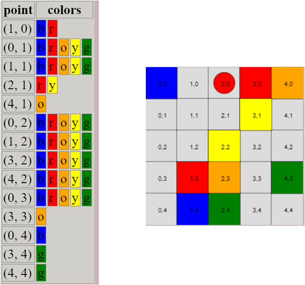

# smart solver
<!-- .element: class="fragment  highlight-blue" --> 

## flow free
---n

## main components
* Forward checking ​
* MRV (minimum remaining value)​
* Degree heuristic​
* Least constraining value​
---n

<!-- .slide: data-auto-animate -->
## variable domain 
* forward checking
* MRV (minimum remaining value)
--v

<!-- .slide: data-auto-animate -->
## variable domain


example in 5x5
--v

## variable domain
code implementation 
```js [1|4|7,8|9]
full_domain = colors

point_domain = []
for value in full_domain:

    assignments[coord] = value
    if is_consistant(initial_state, {coord: value},
                    assignments, inp, connected_terminals):
        point_domain += value
    del assignments[coord]

return point_domain
```
--

## variable domain    
example 


<!-- .element class="r-stretch" -->
--

<!-- .slide:  data-transition="none" -->
## variable domain    
example 


<!-- .element class="r-stretch" -->
--

<!-- .slide:  data-transition="none" -->
## variable domain    
example 


<!-- .element class="r-stretch" -->
--

<!-- .slide:  data-transition="none" -->
## variable domain    
example 


<!-- .element class="r-stretch" -->
---

# forward checking 
* find domain for variables
* if variable has zero domain 
* return case failure
--

## forward checking 
```python [|3]
def forward_check(variables_domain):
    for coords in variables_domain:
        if len(variables_domain[coords]) == 0:
            return False
    return True
```
--

<!-- .slide: data-auto-animate -->
## results
* without forward_check
  | map​ | time​ | Number of hits​ |
  |------|-------|-----------------|
  | 5x5​ | 7 ms​ | 443             |
--

<!-- .slide: data-auto-animate -->
## results
* without forward_check
  | map​ | time​ | Number of hits​ |
  |------|-------|-----------------|
  | 5x5​ | 7 ms​ | 443 <!-- .element: class="fragment  highlight-red" -->            |


* with forward_check
 <!-- .element: style="margin-top:100px" -->
  | map​ | time​ | Number of hits​ |
  |------|-------|-----------------|
  | 5x5​ | 9 ms​ | 28​ <!-- .element: class="fragment  highlight-blue" -->             |
---

<!-- .slide: data-auto-animate -->
# MRV
* find domain for variables
* choose variables with smallest domain
--

<!-- .slide: data-auto-animate -->
# MRV
* implementation
```python [1-2|3|5|9,10]
    smallest_domain = math.inf
    selected_coords = []
    for coord in variables_domain:
        domain_len = len(variables_domain[coord])
        if domain_len < smallest_domain:
            selected_coords = []
            smallest_domain = domain_len

        if smallest_domain == domain_len:
            selected_coords.append(coord)

    return selected_coords
```
--

<!-- .slide: data-auto-animate -->
# MRV
applying to 5x5


<!-- .element class="r-stretch" -->
--

<!-- .slide: data-auto-animate -->
# MRV
applying to 5x5


<!-- .element class="r-stretch" -->
--

#### results *
--

#### limitation
- complexty increase with map size (give example)
---

### improvment in constrains
- https://github.com/A-Siam/FlowFree/pull/7
--

### dynamic domain-upgrade
- https://github.com/A-Siam/FlowFree/pull/15
--

#### explain
- the constrained variables (what they are how to get them)
- tease for degree heuristic
--

<style>
    #result_table > tbody > tr >td {
        font-size: 25px;
    }

</style>
#### results
| map​       | time​    | Number of hits​ |
|------------|----------|-----------------|
| 5x5​       | 6 ms​    | 17​             |
| 7x7​       | 16ms​    | 41​             |
| 8x8​       | 30 ms​   | 52​             |
| 9x9 (1)​   | 57ms​    | 67​             |
| 10x10 (1)​ | 189ms​   | 320​            |
| 10x10(2)​  | 93ms​    | 139​            |
| 12x12​     | 290ms​   | 331​            |
| 12x14​     | 193ms​   | 148​            |
| 14x14​     | 78750ms​ | 10309​          |
<!-- .element: class="r-stretch" id="result_table"-->
---

## degree heuristic
- explain
- relation to constrained variables
--

### results
- blaim implementaion
- we will get better without it
---

## least constraing value
- explain
--

#### result 
--

### special credit for 1414
- explain the initial choice
---