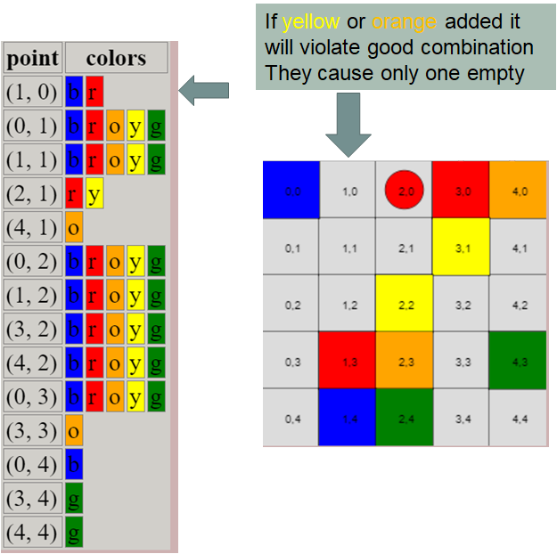
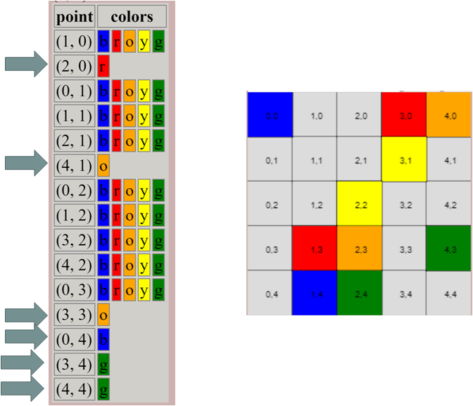
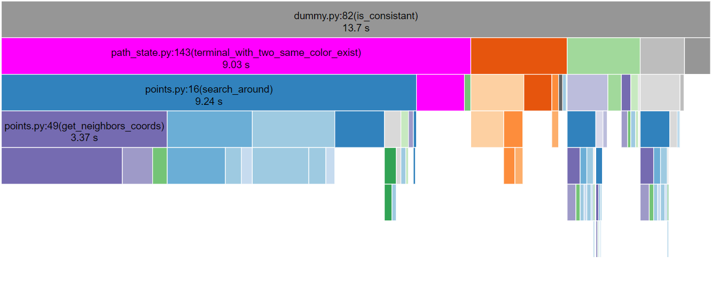

# smart solver
<!-- .element: class="fragment  highlight-blue" --> 

## flow free
---n

## main components
* Forward checking ​
* MRV (minimum remaining value)​
* Degree heuristic​
* Least constraining value​
---n

<!-- .slide: data-auto-animate -->
## variable domain 
* forward checking
* MRV (minimum remaining value)
--v

<!-- .slide: data-auto-animate -->
## variable domain


example in 5x5
--v

## variable domain
code implementation 
```js [1|4|7,8|9]
full_domain = colors

point_domain = []
for value in full_domain:

    assignments[coord] = value
    if is_consistant(initial_state, {coord: value},
                    assignments, inp, connected_terminals):
        point_domain += value
    del assignments[coord]

return point_domain
```
--v
<!-- TODO use r-stack -->
<!-- .slide:  data-transition="none" -->
## variable domain    
example 


<!-- .element class="r-stretch" -->
--v

<!-- .slide:  data-transition="none" -->
## variable domain    
example 


<!-- .element class="r-stretch" -->
--v

<!-- .slide:  data-transition="none" -->
## variable domain    
example 


<!-- .element class="r-stretch" -->
--v

<!-- .slide:  data-transition="none" -->
## variable domain    
example 


<!-- .element class="r-stretch" -->
---n

# forward checking 
* find domain for variables
* if variable has zero domain 
* return case failure
--v

## forward checking 
```python [|3]
def forward_check(variables_domain):
    for coords in variables_domain:
        if len(variables_domain[coords]) == 0:
            return False
    return True
```
--v

<!-- .slide: data-auto-animate -->
## results
* without forward_check
  | map​ | time​ | Number of hits​ |
  |------|-------|-----------------|
  | 5x5​ | 7 ms​ | 443             |
--v

<!-- .slide: data-auto-animate -->
## results
* without forward_check
  | map​ | time​ | Number of hits​ |
  |------|-------|-----------------|
  | 5x5​ | 7 ms​ | 443 <!-- .element: class="fragment  highlight-red" -->            |


* with forward_check
 <!-- .element: style="margin-top:100px" -->
  | map​ | time​ | Number of hits​ |
  |------|-------|-----------------|
  | 5x5​ | 9 ms​ | 28​ <!-- .element: class="fragment  highlight-blue" -->             |
---n

<!-- .slide: data-auto-animate -->
# MRV
* find domain for variables
* choose variables with smallest domain
--v

<!-- .slide: data-auto-animate -->
# MRV
* implementation
```python [1-2|3|5|9,10]
    smallest_domain = math.inf
    selected_coords = []
    for coord in variables_domain:
        domain_len = len(variables_domain[coord])
        if domain_len < smallest_domain:
            selected_coords = []
            smallest_domain = domain_len

        if smallest_domain == domain_len:
            selected_coords.append(coord)

    return selected_coords
```
--v

<!-- .slide: data-auto-animate -->
# MRV
applying to 5x5


<!-- .element class="r-stretch" -->
--v

<!-- .slide: data-auto-animate -->
# MRV
applying to 5x5


<!-- .element class="r-stretch" -->
--v

#### results *
<!-- https://github.com/A-Siam/FlowFree/pull/2 -->
| map  | time (s) |
| ---- | -------- |
| 7x7  |  1.87    |
| 8x8  |  1.73    |
| 9x9  |  6.87    |
| 10x10  |  ?.??    |


--v
<!-- .slide: data-auto-animate -->
### limitation
* variable domain calculation increase with map size

  * example 
<!-- .element: class="fragment" -->
    * 14x14 every time caluclate domain <br/>
      for (<span class="fragment highlight-blue">196 </span> -  terminals) variable
  * solution
<!-- .element: class="fragment" -->
    * update only constrained varialbes

* consistency check represent the bottleneck
--v
<!-- .slide: data-auto-animate -->
### limitation
* variable domain calculation increase with map size
  
* consistency check represent the bottleneck
  
  <span class="fragment"> check <span class="fragment highlight-blue">profile </span>analysis and improve as possible </span>

  
---n
# optimization
<!-- .element: class="r-fit-text" -->
--v

<!-- https://github.com/A-Siam/FlowFree/pull/7 -->
<!-- .slide: data-auto-animate -->
### improvement in constrains
profile for 991


<span> terminal constrain was checking <span class="fragment highlight-red"> every </span>terminal has only on path </span>
--v
<!-- .slide: data-auto-animate -->
### improvement in constrains
profile for 991


<span> check only <span class="fragment highlight-blue"> neighbor </span> terminals </span>
--v

#### results
<!-- https://github.com/A-Siam/FlowFree/pull/2 -->
| map  | time (s) |
| ---- | -------- |
| 7x7  |  0.085    |
| 8x8  |  0.157    |
| 9x9  |  0.858    |
| 10x10(1)  |  3.300    |
| 10x10(2)  |  1.680    |
| 12x12  |  14.971    |
| 12x14  |  ??.???    |
<!-- .element: class="r-stretch" -->
--v

<!-- .slide: data-auto-animate -->
### dynamic domain-upgrade

* save variable domain
* only update <span class="fragment highlight-blue">constrained variables</span>
--v

<!-- .slide: data-auto-animate -->
### dynamic domain-upgrade

* the constrained variables

  * are variables who share constrain with last updated variable

--v

<!-- .slide: data-auto-animate -->
### dynamic domain-upgrade

* the constrained variables

  *  are empty neighbor  <span class="fragment highlight-blue"> (point good combination) </span>
--v
<!-- .slide: data-auto-animate -->
### dynamic domain-upgrade

* the constrained variables


--v
<!-- .slide: data-auto-animate -->
### dynamic domain-upgrade

* the constrained variables


--v

<!-- .slide: data-auto-animate -->
### dynamic domain-upgrade

* the constrained variables
  
  * are empty neighbor (point good combination) 
  
  * <span class="fragment"> empty neighbor for occupied neighbor 
    <span class="fragment highlight-blue"> (neighbors/terminal good combination) </span> </span> 

--v
<!-- .slide: data-auto-animate -->
### dynamic domain-upgrade

* the constrained variables


--v

<!-- .slide: data-auto-animate -->
### dynamic domain-upgrade

* the constrained variables


--v
<!-- .slide: data-auto-animate -->
### dynamic domain-upgrade

* the constrained variables
  *  are empty neighbor  (point good combination) 
  * are empty neighbor for occupied neighbor   
      (point neighbors/terminal combination)
  * <span class="fragment" > every point when terminal is connected 
      <span class="fragment highlight-blue"> (terminal connected) </span> </span>

--v
### dynamic domain-upgrade
implementation
```python [2,4|5,6|11,12|13|14]
variables_domain = {}
connection_changed = len(connected_terminals)>len(prev_connected_terminal)
first_run = prev_variable == None
if connection_changed or first_run:
    # update all variables
    for coord in variables:
        domain = get_available_domain(coord,
        assignments,connected_terminals)
        variables_domain[coord] = domain
else:
    variables_domain = pickle.loads(pickle.dumps(prev_domain))
    del variables_domain[prev_variable]
    big_neighbors = get_constrained_neighbors(prev_variable,inp,assignments )
    for coord in big_neighbors:
        domain = get_available_domain(coord, assignments, inp,connected_terminals)
        variables_domain[coord] = domain
return variables_domain
```
<!-- .element: class="r-stretch" -->

--v
<style>
    #result_table > tbody > tr >td {
        font-size: 25px;
    }

</style>
#### results
| map​       | time​    | Number of hits​ |
|------------|----------|-----------------|
| 5x5​       | 6 ms​    | 17​             |
| 7x7​       | 16 ms​    | 41​             |
| 8x8​       | 30 ms​   | 52​             |
| 9x9 (1)​   | 57 ms​    | 67​             |
| 10x10 (1)​ | 189 ms​   | 320​            |
| 10x10(2)​  | 93 ms​    | 139​            |
| 12x12​     | 290 ms​   | 331​            |
| 12x14​     | 193 ms​   | 148​            |
| 14x14​     | 7875 ms​ | 10309​          |
<!-- .element: class="r-stretch" id="result_table"-->
---n

## degree heuristic
- explain
- relation to constrained variables
--v

### results
- blaim implementaion
- we will get better without it
---n

## least constraining value
- choose value that doesn't affect domains
--v

## least constraining value
implementation
<!-- TODO simplify this -->
```python
smallest_number_of_constraints = math.inf
count_value_ordered = []

variables = free_vars({**{coord: 'holder'}, **assignments}, inp)
domain = variables_domain[coord]
for value in domain:
    updated_connected_terminals = connected_terminals = refresh_connected_terminals(
            {coord: value}, {**{coord: value}, **assignments}, connected_terminals, initial_state, inp)
    updated_variable_domains = get_available_domain_multiple(
        initial_state, variables, {**{coord: value}, **assignments}, inp, updated_connected_terminals,
         variables_domain, coord, None, connected_terminals)
    count_constrained = 0
    
    for coord in updated_variable_domains:
        if len(updated_variable_domains[coord]) < len(variables_domain[coord]):
            count_constrained += 1

    count_value_ordered.append((count_constrained, value))

count_value_ordered.sort()
order_domain_values = []
for count, value in count_value_ordered:
    order_domain_values += value

return order_domain_values
```
--v

### for 1414
- explain the initial choice
---
--v
<!-- .slide:  data-transition="none" -->
#### results
| map​       | time​    | Number of hits​ |
|------------|----------|-----------------|
| 5x5​       | 6 ms​    | 17​             |
| 7x7​       | 16 ms​    | 41​             |
| 8x8​       | 30 ms​   | 52​             |
| 9x9 (1)​   | 57 ms​    | 67​             |
| 10x10 (1)​ | 189 ms​   | 320​            |
| 10x10(2)​  | 93 ms​    | 139​            |
| 12x12​     | 290 ms​   | 331​            |
| 12x14​     | 193 ms​   | 148​            |
| 14x14​     | 7875 ms​ | 10309​          |
<!-- .element: class="r-stretch result_table" data-id="table"-->
<style>
    .result_table > tbody > tr >td {
        font-size: 25px;
    }

</style>
--v

<!-- .slide:  data-transition="none" -->
#### results
| map​       | time​    | Number of hits​ |
|------------|----------|-----------------|
| 5x5​       | 5 ms​    | 17​             |
| 7x7​       | 16 ms     | 56​             |
| 8x8​       | 23 ms​    | 52​             |
| 9x9 (1)​   | 65 ms​    | 100             |
| 10x10 (1)​ | 166 ms​   | 330​            |
| 10x10(2)​  |<span style="color:red"> 240 ms​    | 482           |
| 12x12​     |<span style="color:red"> 838 ms​    | 1178            |
| 12x14​     |<span style="color:aqua"> 163 ms​   | 146​            |
| 14x14​     |<span style="color:aqua"> 2230 ms​| 2374​          |
<!-- .element: class="r-stretch result_table"  data-id="table"-->
<style>
    .result_table > tbody > tr >td {
        font-size: 25px;
    }

</style>
---n

# animation
--v
<iframe src="http://127.0.0.1:5000/" class="r-stretch"></iframe>
---n